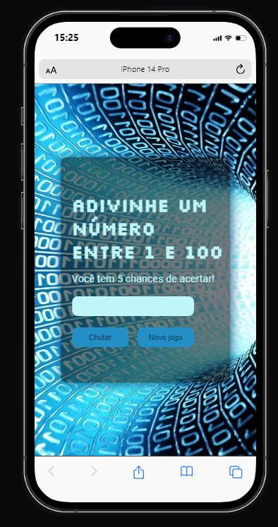

# Adivinhe o Número

Este é um projeto criado para praticar HTML, CSS e JavaScript. Ele consiste em um jogo de adivinhação, onde os usuários podem chutar números de 1 a 100 para acertar o número sorteado pelo programa.

## Screenshots
 

## Funcionalidades

- Número Secreto Aleatório: O jogo escolhe um número aleatório entre 1 e 100 (você pode ajustar o intervalo conforme desejado).
- Limite de Tentativas: O jogador tem um número limitado de tentativas para adivinhar o número secreto. Por padrão, são fornecidas 5 tentativas.
- Feedback Interativo: Após cada tentativa, o jogador recebe feedback indicando se o número que eles escolheram é maior ou menor que o número secreto.
- Fim do Jogo: O jogo termina quando o jogador adivinha corretamente o número secreto ou excede o limite de tentativas

## Como Jogar:
 Insira um número no campo de entrada e clique no botão "Chutar".
 Você receberá feedback indicando se seu palpite é maior ou menor que o número secreto.
 Continue adivinhando até acertar o número ou esgotar suas tentativas.

## Reiniciar o Jogo:
- Após o fim do jogo (você acertar o número ou exceder o limite de tentativas), você pode iniciar um novo jogo clicando no botão "Novo jogo".

## Tecnologias Utilizadas

- **HTML5**
- **CSS3**
- **JavaScript**

## Como Utilizar

1. Clone este repositório em sua máquina local:

   ```bash
   git clone https://github.com/seu-usuario/nome-do-repositorio.git
2. Navegue até o diretório do projeto:

    ```bash
    cd nome-do-repositorio
3. Abra o arquivo index.html em seu navegador web. Você pode abrir o arquivo index.html clicando duas vezes nele ou utilizando um navegador web e navegando até o arquivo. Agora você está pronto para jogar "Adivinhe o Número"!


## Contribuindo
Contribuições são bem-vindas! Se você quiser melhorar este projeto, sinta-se à vontade para enviar um pull request. Antes de enviar, por favor, abra uma issue para discutir as mudanças propostas.

## Licença
Este projeto está licenciado sob a MIT License.
